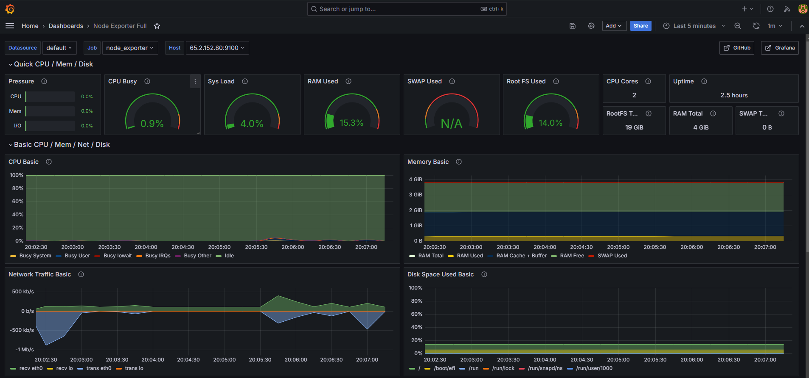

# Devops Netflix Clone on Cloud using Jenkins 

## Introduction: 
In this project, we'll deploy a complete Netflix homepage with real movies. A docker image will be created which will be deployed automatically on our main server using Jenkins. A separate monitoring server will be created to monitor our main server. Security measures in this project include SonarQube which will test the integrity of our code and Trivy to test the integrity of our docker image. On every successful build, we will recieve email notifications from Jenkins using the SMTP server.

## Services used:

* AWS EC2
* Docker
* Jenkins
* OWASP
* SonarQube
* Trivy
* Prometheus
* Grafana
* Node Exporter

## Server distribution:

* Main server (t2.large)
    * Docker
    * Jenkins 
    * Owasp 
    * Sonarqube
    * Trivy
* Monitoring server (t2.medium) 
    * Prometheus
    * Grafana
    * NodeExporter

## **Phase 1: Initial Setup and Deployment**

**Step 1: Launch a t2.large EC2 instance (Ubuntu 22.04):**

- Provision an EC2 instance on AWS with Ubuntu 22.04.
- Connect to the instance using SSH.

**Step 2: Clone the Code:**

- Update all the packages and then clone the code.
- Clone your application's code repository onto the EC2 instance:
    
    ```bash
    git clone https://github.com/N4si/DevSecOps-Project.git
    ```
    

**Step 3: Install Docker and Run the App Using a Container:**

- Set up Docker on the EC2 instance:
    
    ```bash
    
    sudo apt-get update
    sudo apt-get install docker.io -y
    sudo usermod -aG docker $USER  # Replace with your system's username, e.g., 'ubuntu'
    newgrp docker
    sudo chmod 777 /var/run/docker.sock
    ```
    

    

**Step 4: Get the API Key:**

To show real-time movies in our Netflix app we'll use a movie database API

- Open a web browser and navigate to the TMDB (The Movie Database) website.
- Click on "Login" and create an account.
- Once logged in, go to your profile and select "Settings."
- Click on "API" from the left-side panel.
- Create a new API key by clicking "Create" and accepting the terms and conditions.
- Provide the required basic details and click "Submit."
- You will receive your TMDB API key.

Dockerfile
```
FROM node:16.17.0-alpine as builder
WORKDIR /app
COPY ./package.json .
COPY ./yarn.lock .
RUN yarn install
COPY . .
ARG TMDB_V3_API_KEY
ENV VITE_APP_TMDB_V3_API_KEY=${TMDB_V3_API_KEY}
ENV VITE_APP_API_ENDPOINT_URL="https://api.themoviedb.org/3"
RUN yarn build

FROM nginx:stable-alpine
WORKDIR /usr/share/nginx/html
RUN rm -rf ./*
COPY --from=builder /app/dist .
EXPOSE 80
ENTRYPOINT ["nginx", "-g", "daemon off;"]
```

Now create the Docker image with your api key:
```
docker build --build-arg TMDB_V3_API_KEY=<your-api-key> -t netflix .
```
Run the image using the following command:
```
docker run -d --name netflix -p 8081:80 netflix:latest
```

## **Phase 2: Security**

1. **Install SonarQube and Trivy:**
    - Install SonarQube and Trivy on the EC2 instance to scan for vulnerabilities.
        
        sonarqube
        ```
        docker run -d --name sonar -p 9000:9000 sonarqube:lts-community
        ```
        
        
        To access: 
        
        publicIP:9000 (by default username & password is admin)
        
        To install Trivy:
        ```
        sudo apt-get install wget apt-transport-https gnupg lsb-release
        wget -qO - https://aquasecurity.github.io/trivy-repo/deb/public.key | sudo apt-key add -
        echo deb https://aquasecurity.github.io/trivy-repo/deb $(lsb_release -sc) main | sudo tee -a /etc/apt/sources.list.d/trivy.list
        sudo apt-get update
        sudo apt-get install trivy        
        ```
        
        to scan image using trivy
        ```
        trivy image <imageid>
        ```

        
2. **Integrate SonarQube and Configure:**
    - Integrate SonarQube with your CI/CD pipeline.
    - Configure SonarQube to analyze code for quality and security issues.


## **Phase 3: CI/CD Setup**

1. **Install Jenkins for Automation:**
    - Install Jenkins on the EC2 instance to automate deployment:
    Install Java
    
    ```bash
    sudo apt update
    sudo apt install fontconfig openjdk-17-jre
    java -version
    openjdk version "17.0.8" 2023-07-18
    OpenJDK Runtime Environment (build 17.0.8+7-Debian-1deb12u1)
    OpenJDK 64-Bit Server VM (build 17.0.8+7-Debian-1deb12u1, mixed mode, sharing)
    
    #jenkins
    sudo wget -O /usr/share/keyrings/jenkins-keyring.asc \
    https://pkg.jenkins.io/debian-stable/jenkins.io-2023.key
    echo deb [signed-by=/usr/share/keyrings/jenkins-keyring.asc] \
    https://pkg.jenkins.io/debian-stable binary/ | sudo tee \
    /etc/apt/sources.list.d/jenkins.list > /dev/null
    sudo apt-get update
    sudo apt-get install jenkins
    sudo systemctl start jenkins
    sudo systemctl enable jenkins
    ```
    
    - Access Jenkins in a web browser using the public IP of your EC2 instance.
        
        publicIp:8080
        
2. **Install Necessary Plugins in Jenkins:**

    Goto Manage Jenkins →Plugins → Available Plugins →

    Install below plugins:

    * Eclipse Temurin Installer (Install without restart)

    * SonarQube Scanner (Install without restart)

    * NodeJs Plugin (Install Without restart)

    * Email Extension Plugin

### **Configure Java and Nodejs in Global Tool Configuration**

Goto Manage Jenkins → Tools → Install JDK(17) and NodeJs(16)→ Click on Apply and Save


## SonarQube integration:

Create the token:

* Goto Jenkins Dashboard → Manage Jenkins → Credentials → Add Secret Text. 

After adding sonar token. Click on Apply and Save


### Note: 
* **The Configure System option** is used in Jenkins to configure different server

* **Global Tool Configuration** is used to configure different tools that we install using Plugins


### **Configure CI/CD Pipeline in Jenkins:**

* Create a CI/CD pipeline in Jenkins to automate your application deployment.


## **Install Dependency-Check and Docker Tools in Jenkins**

**Install Dependency-Check Plugin:**

- Go to "Dashboard" in your Jenkins web interface.
- Navigate to "Manage Jenkins" → "Manage Plugins."
- Click on the "Available" tab and search for "OWASP Dependency-Check."
- Check the checkbox for "OWASP Dependency-Check" and click on the "Install without restart" button.

**Configure Dependency-Check Tool:**

- After installing the Dependency-Check plugin, you need to configure the tool.
- Go to "Dashboard" → "Manage Jenkins" → "Global Tool Configuration."
- Find the section for "OWASP Dependency-Check."
- Add the tool's name, e.g., "DP-Check."
- Save your settings.

**Install Docker Tools and Docker Plugins:**

- Go to "Dashboard" in your Jenkins web interface.
- Navigate to "Manage Jenkins" → "Manage Plugins."
- Click on the "Available" tab and search for "Docker."
- Check the following Docker-related plugins:
  - Docker
  - Docker Commons
  - Docker Pipeline
  - Docker API
  - docker-build-step
- Click on the "Install without restart" button to install these plugins.

**Add DockerHub Credentials:**

- To securely handle DockerHub credentials in your Jenkins pipeline, follow these steps:
  - Go to "Dashboard" → "Manage Jenkins" → "Manage Credentials."
  - Click on "System" and then "Global credentials (unrestricted)."
  - Click on "Add Credentials" on the left side.
  - Choose "Secret text" as the kind of credentials.
  - Enter your DockerHub credentials (Username and Password) and give the credentials an ID (e.g., "docker").
  - Click "OK" to save your DockerHub credentials.

Now, you have installed the Dependency-Check plugin, configured the tool, and added Docker-related plugins along with your DockerHub credentials in Jenkins. You can now proceed with configuring your Jenkins pipeline to include these tools and credentials in your CI/CD process.

```groovy

pipeline{
    agent any
    tools{
        jdk 'jdk17'
        nodejs 'node16'
    }
    environment {
        SCANNER_HOME=tool 'sonar-scanner'
    }
    stages {
        stage('clean workspace'){
            steps{
                cleanWs()
            }
        }
        stage('Checkout from Git'){
            steps{
                git branch: 'main', url: 'https://github.com/N4si/DevSecOps-Project.git'
            }
        }
        stage("Sonarqube Analysis "){
            steps{
                withSonarQubeEnv('sonar-server') {
                    sh ''' $SCANNER_HOME/bin/sonar-scanner -Dsonar.projectName=Netflix \
                    -Dsonar.projectKey=Netflix '''
                }
            }
        }
        stage("quality gate"){
           steps {
                script {
                    waitForQualityGate abortPipeline: false, credentialsId: 'Sonar-token' 
                }
            } 
        }
        stage('Install Dependencies') {
            steps {
                sh "npm install"
            }
        }
        stage('OWASP FS SCAN') {
            steps {
                dependencyCheck additionalArguments: '--scan ./ --disableYarnAudit --disableNodeAudit', odcInstallation: 'DP-Check'
                dependencyCheckPublisher pattern: '**/dependency-check-report.xml'
            }
        }
        stage('TRIVY FS SCAN') {
            steps {
                sh "trivy fs . > trivyfs.txt"
            }
        }
        stage("Docker Build & Push"){
            steps{
                script{
                   withDockerRegistry(credentialsId: 'docker', toolName: 'docker'){   
                       sh "docker build --build-arg TMDB_V3_API_KEY=<yourapikey> -t netflix ."
                       sh "docker tag netflix nasi101/netflix:latest "
                       sh "docker push nasi101/netflix:latest "
                    }
                }
            }
        }
        stage("TRIVY"){
            steps{
                sh "trivy image nasi101/netflix:latest > trivyimage.txt" 
            }
        }
        stage('Deploy to container'){
            steps{
                sh 'docker run -d --name netflix -p 8081:80 nasi101/netflix:latest'
            }
        }
    }
    post {
     always {
        emailext attachLog: true,
            subject: "'${currentBuild.result}'",
            body: "Project: ${env.JOB_NAME}<br/>" +
                "Build Number: ${env.BUILD_NUMBER}<br/>" +
                "URL: ${env.BUILD_URL}<br/>",
            to: 'kamblearyanak10@gmail.com',        #change mail here
            attachmentsPattern: 'trivyfs.txt,trivyimage.txt'
        }
    }
}


```
Jenkins Dashboard


 This image represents the above pipeline's steps

After successful pipeline status, a docker image will be pushed in your Docker hub account


### Note: 
If you get docker login failed error,  
Run: 
```
sudo su
sudo usermod -aG docker jenkins
sudo systemctl restart jenkins
```


## **Phase 4: Monitoring**

1. **Install Prometheus and Grafana:**


   Launch another EC2 instance(use t2.medium). Set up Prometheus and Grafana to monitor your application.

   **Installing Prometheus:**

   First, create a dedicated Linux user for Prometheus and download Prometheus:

   ```bash
   sudo useradd --system --no-create-home --shell /bin/false prometheus
   wget https://github.com/prometheus/prometheus/releases/download/v2.47.1/prometheus-2.47.1.linux-amd64.tar.gz
   ```

   Extract Prometheus files, move them, and create directories:

   ```bash
   tar -xvf prometheus-2.47.1.linux-amd64.tar.gz
   cd prometheus-2.47.1.linux-amd64/
   sudo mkdir -p /data /etc/prometheus
   sudo mv prometheus promtool /usr/local/bin/
   sudo mv consoles/ console_libraries/ /etc/prometheus/
   sudo mv prometheus.yml /etc/prometheus/prometheus.yml
   ```

   Set ownership for directories:

   ```bash
   sudo chown -R prometheus:prometheus /etc/prometheus/ /data/
   ```

   Create a systemd unit configuration file for Prometheus:

   ```bash
   sudo nano /etc/systemd/system/prometheus.service
   ```

   Add the following content to the `prometheus.service` file:

   ```plaintext
   [Unit]
   Description=Prometheus
   Wants=network-online.target
   After=network-online.target

   StartLimitIntervalSec=500
   StartLimitBurst=5

   [Service]
   User=prometheus
   Group=prometheus
   Type=simple
   Restart=on-failure
   RestartSec=5s
   ExecStart=/usr/local/bin/prometheus \
     --config.file=/etc/prometheus/prometheus.yml \
     --storage.tsdb.path=/data \
     --web.console.templates=/etc/prometheus/consoles \
     --web.console.libraries=/etc/prometheus/console_libraries \
     --web.listen-address=0.0.0.0:9090 \
     --web.enable-lifecycle

   [Install]
   WantedBy=multi-user.target
   ```

   Here's a brief explanation of the key parts in this `prometheus.service` file:

   - `User` and `Group` specify the Linux user and group under which Prometheus will run.

   - `ExecStart` is where you specify the Prometheus binary path, the location of the configuration file (`prometheus.yml`), the storage directory, and other settings.

   - `web.listen-address` configures Prometheus to listen on all network interfaces on port 9090.

   - `web.enable-lifecycle` allows for management of Prometheus through API calls.

   Enable and start Prometheus:

   ```bash
   sudo systemctl enable prometheus
   sudo systemctl start prometheus
   ```

   Verify Prometheus's status:

   ```bash
   sudo systemctl status prometheus
   ```

   You can access Prometheus in a web browser using your server's IP and port 9090:

   `http://<your-server-ip>:9090`

   

   ## **Installing Node Exporter:**

   ### Node Exporter is an agent that gathers system metrics and exposes them in a format hich can be injested by Prometheus.

   Create a system user for Node Exporter and download Node Exporter:

   ```bash
   sudo useradd --system --no-create-home --shell /bin/false node_exporter
   wget https://github.com/prometheus/node_exporter/releases/download/v1.6.1/node_exporter-1.6.1.linux-amd64.tar.gz
   ```

   Extract Node Exporter files, move the binary, and clean up:

   ```bash
   tar -xvf node_exporter-1.6.1.linux-amd64.tar.gz
   sudo mv node_exporter-1.6.1.linux-amd64/node_exporter /usr/local/bin/
   rm -rf node_exporter*
   ```

   Create a systemd unit configuration file for Node Exporter:

   ```bash
   sudo nano /etc/systemd/system/node_exporter.service
   ```

   Add the following content to the `node_exporter.service` file:

   ```plaintext
   [Unit]
   Description=Node Exporter
   Wants=network-online.target
   After=network-online.target

   StartLimitIntervalSec=500
   StartLimitBurst=5

   [Service]
   User=node_exporter
   Group=node_exporter
   Type=simple
   Restart=on-failure
   RestartSec=5s
   ExecStart=/usr/local/bin/node_exporter --collector.logind

   [Install]
   WantedBy=multi-user.target
   ```

   Replace `--collector.logind` with any additional flags as needed.

   Enable and start Node Exporter:

   ```bash
   sudo systemctl enable node_exporter
   sudo systemctl start node_exporter
   ```

   Verify the Node Exporter's status:

   ```bash
   sudo systemctl status node_exporter
   ```

   Now to access Node Exporter metrics in Prometheus, first we need to configure it in prometheus.yaml file.

2. **Configure Prometheus Plugin Integration:**

   Integrate Jenkins with Prometheus to monitor the CI/CD pipeline.

   **Prometheus Configuration:**

   To configure Prometheus to scrape metrics from Node Exporter and Jenkins, you need to modify the `prometheus.yml` file. Here is an example `prometheus.yml` configuration for your setup:

   ```yaml
   global:
     scrape_interval: 15s

   scrape_configs:
     - job_name: 'node_exporter'
       static_configs:
         - targets: ['localhost:9100']

     - job_name: 'jenkins'
       metrics_path: '/prometheus'
       static_configs:
         - targets: ['<your-jenkins-ip>:<your-jenkins-port>']
   ```

   Make sure to replace `<your-jenkins-ip>` and `<your-jenkins-port>` with the appropriate values for your Jenkins setup.

   Check the validity of the configuration file:

   ```bash
   promtool check config /etc/prometheus/prometheus.yml
   ```

   Reload the Prometheus configuration without restarting:

   ```bash
   curl -X POST http://localhost:9090/-/reload
   ```

   You can access Prometheus targets at:

   `http://<your-prometheus-ip>:9090/targets`


### Grafana installation
---------
Grafana is a powerful tool for creating visualizations and dashboards, and you can further customize it to suit your specific monitoring needs.

**Install Grafana on Ubuntu 22.04 and Set it up to Work with Prometheus**

**Step 1: Install Dependencies:**

First, ensure that all necessary dependencies are installed:

```bash
sudo apt-get update
sudo apt-get install -y apt-transport-https software-properties-common
```

**Step 2: Add the GPG Key:**

Add the GPG key for Grafana:

```bash
wget -q -O - https://packages.grafana.com/gpg.key | sudo apt-key add -
```

**Step 3: Add Grafana Repository:**

Add the repository for Grafana stable releases:

```bash
echo "deb https://packages.grafana.com/oss/deb stable main" | sudo tee -a /etc/apt/sources.list.d/grafana.list
```

**Step 4: Update and Install Grafana:**

Update the package list and install Grafana:

```bash
sudo apt-get update
sudo apt-get -y install grafana
```

**Step 5: Enable and Start Grafana Service:**

To automatically start Grafana after a reboot, enable the service:

```bash
sudo systemctl enable grafana-server
```

Then, start Grafana:

```bash
sudo systemctl start grafana-server
```

**Step 6: Check Grafana Status:**

Verify the status of the Grafana service to ensure it's running correctly:

```bash
sudo systemctl status grafana-server
```

**Step 7: Access Grafana Web Interface:**

You can just open a web browser and navigate to Grafana using your server's IP address. The default port for Grafana is 3000. For example:

`http://<your-server-ip>:3000`

You'll be prompted to log in to Grafana. The default username is "admin," and the default password is "admin."

**Step 8: Change the Default Password:**

When you log in for the first time, Grafana will prompt you to change the default password for security reasons. Follow the prompts to set a new password.

**Step 9: Add Prometheus Data Source:**

To visualize metrics, you need to add a data source. Follow these steps:

- Click on the gear icon (⚙️) in the left sidebar to open the "Configuration" menu.

- Select "Data Sources."

- Click on the "Add data source" button.

- Choose "Prometheus" as the data source type.

- In the "HTTP" section:
  - Set the "URL" to `http://localhost:9090` (assuming Prometheus is running on the same server).
  - Click the "Save & Test" button to ensure the data source is working.

**Step 10: Import a Dashboard:**

To make it easier to view metrics, you can import a pre-configured dashboard. Follow these steps:

- Click on the "+" (plus) icon in the left sidebar to open the "Create" menu.

- Select "Dashboard."

- Click on the "Import" dashboard option.

- Enter the dashboard code you want to import (e.g., code 1860).

- Click the "Load" button.

- Select the data source you added (Prometheus) from the dropdown.

- Click on the "Import" button.

You should now have a Grafana dashboard set up to visualize metrics from Prometheus.



That's it! You've successfully installed and set up Grafana to work with Prometheus for monitoring and visualization.

2. **Similarly Configure Prometheus Plugin Integration:**
    - Integrate Jenkins with Prometheus to monitor the CI/CD pipeline.


## **Phase 5: Notification**

1. **Implement Notification Services:**
    * Set up email notifications in Jenkins or other notification mechanisms.
    * In your gmail account create an app password from the security section for testing purposes.(Gmail will not allow to use your original account password)
    * Navigate to "Manage Jenkins" → "System."
    * Scroll down to find Email notification section

    * In SMTP server input - smtp.gmail.com
    * In user-email suffix put - your mail id 
    * In advanced tab -
        * Username- gmail id
        * password- app password generated from gmail
        * Tick SSL 
        * Use port - 465

    * Now search for Extended Email notification
        * put same options as above
        * Default content type - HTML
        * Triggers- Always (you can add according to your need)
    
    * Apply and save

    


## **Access your Application**
   - To Access the app make sure port 30007 is open in your security group and then open a new tab paste your NodeIP:30007, your app should be running.


## Security gropus of EC2 instances

Main server


Monitoring server


## **Phase 6: Cleanup**

1. **Cleanup AWS EC2 Instances:**
    - Terminate AWS EC2 instances that are no longer needed.

# This project will be continued later for additional features.
 * Pushing docker image from Jenkins to AWS ECR and further deploying in AWS EKS for continuous deployment.


